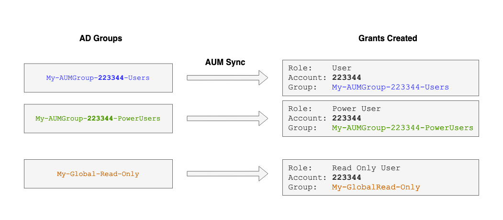

[](https://opensource.newrelic.com/oss-category/#new-relic-experimental)

# Automatic Grants for AUM Synced Groups


This script, that can be run in a New Relic Synthetic API monitor, automates the creation of grants for new groups as they appear after syncing via [SCIM AUM](https://docs.newrelic.com/docs/accounts/accounts/automated-user-management/automated-user-provisioning-single-sign/).

This use case expects the accounts and roles that are the targets for the grants to already exist. Synced group names are expected to contain the account ID. This account ID is used along with a role mapping to determine what grants to generate.

Additionally the script creates grants for 'global' groups with roles specified by configuration.



## Configuration
Configuration is explained in the script. Add the [script.js](script.js) content to an "Endpoint availability" (Scripted API) synthetic monitor. 

You will require a user API key that has organisaztion management rights. Its highly recommended to supply this value via a [secure credential](https://docs.newrelic.com/docs/synthetics/synthetic-monitoring/using-monitors/store-secure-credentials-scripted-browsers-api-tests/). 

To determine some configuration values you will need to use the New Relic graphQL API:[US Datacenter](https://api.newrelic.com/graphiql) / [EU Datacenter](https://api.eu.newrelic.com/graphiql)

### Local setup
You can run this script locally, be sure to `npm install` to install dependencies then `node script.js` to run.

### Authentication Domain ID
You can discover your authentication domain ID with this graphQL query:

```
{
  actor {
    organization {
      authorizationManagement {
        authenticationDomains {
          authenticationDomains {
            id
            name
          }
        }
      }
    }
  }
}
```

### Roles
You can discover your role ID's with this graphQL query:
```
{
  actor {
    organization {
      authorizationManagement {
        roles {
          roles {
            id
            name
          }
        }
      }
    }
  }
}
```

## Support

New Relic has open-sourced this project. This project is provided AS-IS WITHOUT WARRANTY OR DEDICATED SUPPORT. Issues and contributions should be reported to the project here on GitHub.

>We encourage you to bring your experiences and questions to the [Explorers Hub](https://discuss.newrelic.com) where our community members collaborate on solutions and new ideas.


## Contributing

We encourage your contributions to improve [Project Name]! Keep in mind when you submit your pull request, you'll need to sign the CLA via the click-through using CLA-Assistant. You only have to sign the CLA one time per project. If you have any questions, or to execute our corporate CLA, required if your contribution is on behalf of a company, please drop us an email at opensource@newrelic.com.

**A note about vulnerabilities**

As noted in our [security policy](../../security/policy), New Relic is committed to the privacy and security of our customers and their data. We believe that providing coordinated disclosure by security researchers and engaging with the security community are important means to achieve our security goals.

If you believe you have found a security vulnerability in this project or any of New Relic's products or websites, we welcome and greatly appreciate you reporting it to New Relic through [HackerOne](https://hackerone.com/newrelic).

## License

Automatic Grants for AUM Synced Groups is licensed under the [Apache 2.0](http://apache.org/licenses/LICENSE-2.0.txt) License.
